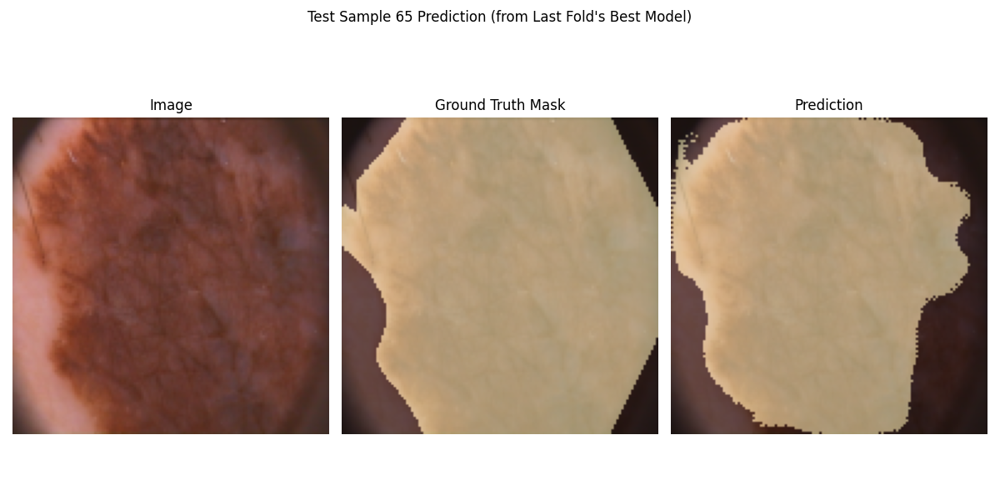
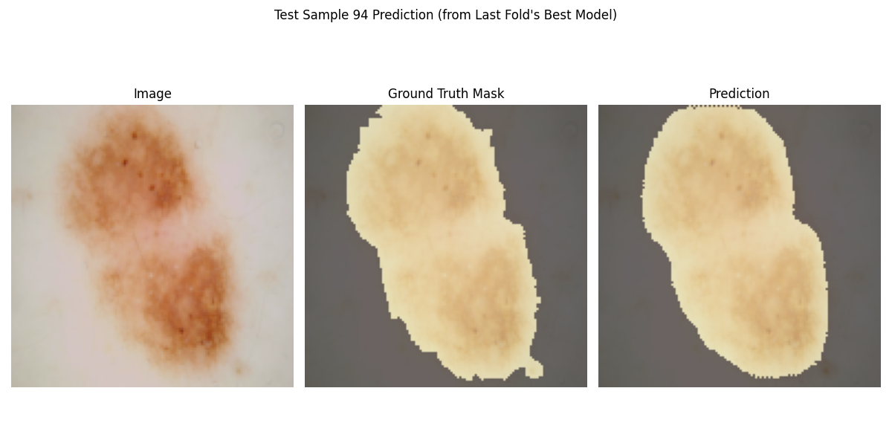

# **U-Net for Skin Lesion Segmentation (ISIC 2016 Dataset)**

## **🚀 Project Overview**

This project implements a **U-Net convolutional neural network** for automated segmentation of skin lesions from dermoscopic images. The model is trained and evaluated on the **ISIC 2016 dataset**, demonstrating robust performance through advanced techniques like **data augmentation** and **K-Fold Cross-Validation**.

### **🔬 Key Features**

- **Standard U-Net Architecture** with encoder-decoder structure and skip connections
- **Advanced Data Augmentation** including flips, brightness/contrast adjustments
- **Combined Loss Function** (BCE + Dice Loss) for optimal segmentation
- **K-Fold Cross-Validation** (5 folds) for robust evaluation
- **Comprehensive Metrics** including Mean IoU, Dice Coefficient, Recall, and Precision

### **📊 Performance Metrics (5-Fold Cross-Validation)**

| Metric | Average Value | Standard Deviation |
|--------|---------------|---------------------|
| **Test Loss** | 0.3168 | ±0.0134 |
| **Test Mean IoU** | 0.3861 | ±0.0080 |
| **Test Dice Coef** | 0.8685 | ±0.0041 |
| **Test Recall** | 0.8662 | ±0.0047 |
| **Test Precision** | 0.9034 | ±0.0102 |

## **📁 Project Structure**

```
U-Net-Skin-Lesion-Segmentation/
├── main.py                          # Main entry point
├── README.md                        # Project documentation
├── requirements.txt                 # Dependencies
├── .gitignore                       # Git ignore rules
├── data/                            # Dataset directory
│   └── isic_2016/                   # ISIC 2016 dataset
├── Results/                         # Training results
├── src/
│   ├── train.py                     # Unified training script (standard + enhanced)
│   ├── unet_model.py                # Standard U-Net model implementation
│   ├── dataloader.py                # Data loading and preprocessing
│   ├── models/                      # Model architectures
│   │   └── attention_unet.py        # Attention U-Net (enhanced)
│   ├── data/                        # Data processing
│   │   └── advanced_augmentation.py # Advanced augmentation
│   ├── utils/                       # Utility functions
│   │   ├── training_utils.py        # Training utilities
│   │   └── post_processing.py       # Post-processing
│   └── visualization/               # Visualization tools
│       └── visualization_utils.py   # Visualization utilities
```

## **📦 Dataset**

### **ISIC 2016: Skin Lesion Analysis Toward Melanoma Detection**

- **900 image-mask pairs** for training and evaluation
- **Dermoscopic images** with expert-annotated segmentation masks

### **How to Obtain the Dataset**

1. **Download** the ISIC 2016 dataset:
   - **Images**: [ISIC-2016_Training_Data.zip](https://isic-archive.com/)
   - **Ground Truth Masks**: [ISIC-2016_Training_Part1_Segmentation_GroundTruth.zip](https://isic-archive.com/)

2. **Organize** the dataset:
   ```
   data/isic_2016/
   ├── images/          # Place ISIC_*.jpg files here
   └── masks/           # Place ISIC_*_segmentation.png files here
   ```

## **🔧 Installation & Setup**

### **Prerequisites**

- Python 3.8+
- TensorFlow 2.x
- OpenCV
- NumPy
- Matplotlib

### **Installation**

```bash
# Clone the repository
git clone https://github.com/joffinkoshy/U-Net-Skin-Lesion-Segmentation.git
cd U-Net-Skin-Lesion-Segmentation

# Create virtual environment (recommended)
python3 -m venv venv
source venv/bin/activate  # On Windows: .\venv\Scripts\activate

# Install dependencies
pip install -r requirements.txt
```

## **🚀 Usage**

### **Basic Training**

```bash
# Train the standard U-Net model
python src/train.py --mode standard

# Train with enhanced features (Attention U-Net)
python src/train.py --mode enhanced
```

### **Custom Configuration**

```bash
# Custom training parameters
python src/train.py --mode enhanced --epochs 100 --batch_size 32 --learning_rate 1e-3

# Debug mode (verbose)
python src/train.py --mode enhanced --debug

# Disable augmentation (for testing)
python src/train.py --mode standard --no_augmentation
```

### **Inference**

```bash
# Run inference on a single image
python main.py --mode inference --image_path test_image.jpg
```

## **📊 Model Architecture**

### **U-Net Architecture**

- **Encoder-Decoder Structure**: Contracting path for context + expanding path for localization
- **Skip Connections**: Transfer high-resolution features from encoder to decoder
- **Input**: 128×128×3 (RGB) images
- **Output**: 128×128×1 segmentation masks with sigmoid activation

### **Attention U-Net (Enhanced)**

- **Attention Gates**: Focus on relevant features
- **Residual Connections**: Better gradient flow
- **Advanced Regularization**: Batch normalization + dropout

## **🎯 Training Strategy**

- **Optimizer**: Adam with learning rate 1×10⁻⁴
- **Batch Size**: 16
- **Loss Function**: Combined BCE + Dice Loss
- **Callbacks**:
  - Early Stopping (patience: 10 epochs)
  - Model Checkpoint (save best validation model)
  - Reduce Learning Rate on Plateau (factor: 0.5, patience: 5 epochs)

## **📈 Results & Visualization**

### **Training History**


### **Sample Predictions**

| Original Image | Ground Truth Mask | Predicted Mask |
|----------------|-------------------|----------------|
|  |  |  |
| *Irregular shape handling* |  |  |
|  |  |  |
| *Multiple lesion components* |  |  |

## **🔬 Advanced Features (Enhanced Version)**

### **1. Advanced Data Augmentation**

- **Elastic Deformation**: Realistic tissue-like deformations
- **Random Rotation**: 0-360° rotation
- **Color Jittering**: Hue, saturation adjustments
- **Gaussian Noise**: Robustness to image noise

### **2. Advanced Training Strategies**

- **Mixed Precision Training**: Faster training, less memory usage
- **AdamW Optimizer**: Weight decay for better regularization
- **Cosine Annealing**: Learning rate scheduling
- **Monte Carlo Dropout**: Uncertainty estimation

### **3. Advanced Metrics**

- **Hausdorff Distance**: Boundary accuracy measurement
- **Grad-CAM Visualization**: Model interpretability
- **Uncertainty Maps**: Confidence visualization

## **💡 Future Enhancements**

1. **Hyperparameter Optimization**: Systematic search using Keras Tuner/Optuna
2. **Advanced Architectures**: U-Net++, ResNet/EfficientNet backbones
3. **Uncertainty Quantification**: Confidence estimation for clinical use
4. **Larger Datasets**: Validation on ISIC 2017/2018 datasets
5. **3D U-Net**: Extension to volumetric medical imaging

## **📚 References**

- **U-Net**: Ronneberger et al. (2015)
- **Attention U-Net**: Oktay et al. (2018)
- **ISIC Dataset**: Gutman et al. (2016)
- **Dice Loss**: Milletari et al. (2016)

## **🤝 Contributing**

Contributions are welcome! Please follow these steps:

1. **Fork** the repository
2. **Create** a feature branch: `git checkout -b feature/your-feature`
3. **Commit** changes: `git commit -m 'Add some feature'`
4. **Push** to branch: `git push origin feature/your-feature`
5. **Open** a pull request

## **📝 License**

This project is licensed under the **MIT License**.

---

**Author**: Joffin Koshy
**Date**: June 2025 (Updated December 2025)
**Version**: 2.0

> "This project demonstrates state-of-the-art techniques in medical image analysis, showcasing advanced skills in deep learning, computer vision, and algorithm optimization for clinical applications."
